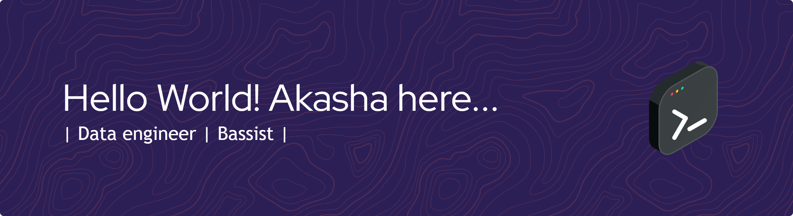

<!--## Hi there 👋 -->

<!--
**bagas32/bagas32** is a ✨ _special_ ✨ repository because its `README.md` (this file) appears on your GitHub profile.

Here are some ideas to get you started:

- 🔭 I’m currently working on ...
- 🌱 I’m currently learning ...
- 👯 I’m looking to collaborate on ...
- 🤔 I’m looking for help with ...
- 💬 Ask me about ...
- 📫 How to reach me: ...
- 😄 Pronouns: ...
- ⚡ Fun fact: ...
-->
<!-- - 🔭 I’m currently working on [**Nothing**](https://en.wikipedia.org/wiki/Nothing#:~:text=Nothing%2C%20no%2Dthing%2C%20or,for%20nothing%20to%20%22exist%22.)
- 🌱 I’m currently learning **Python** 🐍 -->

### Languages

  
  
  
  
  
  
  

### Database

### Framework

### IDE

### Social

  

  
  

###

<picture>
  <source media="(prefers-color-scheme: dark)" srcset="https://raw.githubusercontent.com/bagas32/bagas32/output/pacman-contribution-graph-dark.svg">
  <source media="(prefers-color-scheme: light)" srcset="https://raw.githubusercontent.com/bagas32/bagas32/output/pacman-contribution-graph.svg">
  
</picture>

###
